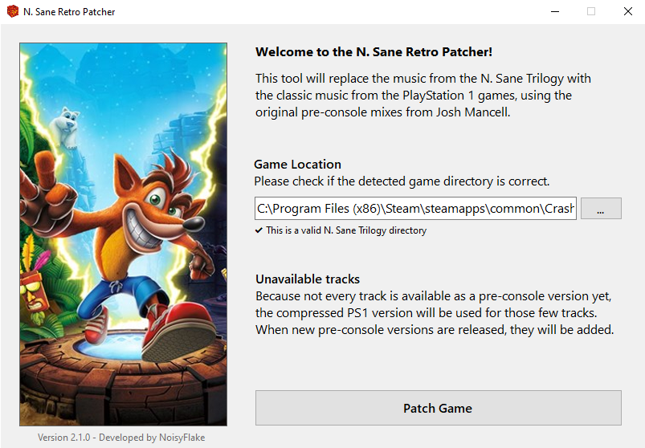

# N. Sane Retro Patcher

This is a Windows application that patches the individual level files of _Crash Bandicoot - The N. Sane Trilogy_ to replace the soundtrack with the original PlayStation 1 soundtrack, using the pre-console mixes of Josh Mancell.

Because not every track is available as a pre-console version yet, the compressed PS1 version will be used for those few tracks. When new pre-console versions are released, they will be added.

## Download & Build

You can download the latest version from the [Releases page](https://github.com/NoisyFlake/NSaneRetroPatcher/releases/latest).

You can build the project with Visual Studio 2022, using .NET Framework 7.0. You'll also need [igArchiveLib](https://github.com/LG-RZ/igArchiveLib) as a dependency of the project.

## Pre-console availability

For the best quality possible, this patcher uses the pre-console mixes by Josh Mancell, which is how the tracks were originally composed before being compressed for the PlayStation 1. However, some tracks are not yet released as a pre-console mix. This table shows what tracks are currently available and included with the N. Sane Retro Patcher.

  
Crash Bandicoot 1 - 83% Completion

 
| Level | Track | Pre-Console mix |
| ---------- | ----- | --------------- |
| N. Sanity Beach, Wumpa Islands | Main Theme | :heavy_check_mark: | 
|                                | Part 2 (Jungle) | :x: | 
| Jungle Rollers, Rolling Stones | Main Theme | :x: | 
| The Great Gate, Native Fortress | Main Theme | :heavy_check_mark: | 
| Boulders, Boulder Dash | Main Theme | :heavy_check_mark: | 
| Upstream, Up the Creek | Main Theme | :heavy_check_mark: | 
| Hog Wild, Whole Hog | Main Theme | :heavy_check_mark: | 
| The Lost City, Sunset Vista | Main Theme | :heavy_check_mark: | 
| Temple Ruins, Jaws of Darkness | Main Theme | :heavy_check_mark: | 
| Road to Nowhere, The High Road | Main Theme | :x: | 
| Heavy Machinery, Castle Machinery | Main Theme | :heavy_check_mark: | 
| Cortex Power | Main Theme | :heavy_check_mark: | 
| Generator Room | Main Theme | :heavy_check_mark: | 
| Toxic Waste | Main Theme | :heavy_check_mark: | 
| Slippery Climb, Stormy Ascent | Main Theme | :heavy_check_mark: | 
| Lights Out, Fumbling in the Dark | Main Theme | :heavy_check_mark: | 
| The Lab | Main Theme | :heavy_check_mark: | 
| The Great Hall | Main Theme | :heavy_check_mark: | 
| | | 
| Papu Papu | Main Theme | :heavy_check_mark: | 
| Ripper Roo | Main Theme | :heavy_check_mark: | 
| Koala Kong | Main Theme | :heavy_check_mark: | 
| Pinstripe Potoroo | Main Theme | :x: | 
| Dr. Nitrus Brio, Brio Bonus Round | Main Theme | :heavy_check_mark: | 
| Dr. Neo Cortex, Cortex Bonus Round | Main Theme | :heavy_check_mark: | 
| Tawna Bonus Round | Main Theme | :heavy_check_mark: | 
  

  
Crash Bandicoot 2 - 69% Completion

 
| Level | Track | Pre-Console mix |
| ---------- | ----- | --------------- |
| Turtle Woods, The Pits, Night Fight | Main Theme | :heavy_check_mark: | 
|                                     | Bonus Round | :x: | 
|                                     | Gem / Skull Route / Totally Fly | :x: | 
| Snow Go, Snow Biz, Cold Hard Crash | Main Theme | :heavy_check_mark: | 
|                                    | Bonus Round | :x: | 
|                                    | Gem / Skull Route | :x: | 
| Hang Eight, Air Crash, Plant Food | Main Theme | :heavy_check_mark: | 
|                                   | Bonus Round | :x: | 
|                                   | Gem / Skull Route | :heavy_check_mark: | 
| Crash Dash, Crash Crush, Un-Bearable | Main Theme | :heavy_check_mark: | 
|                                      | Bonus Round | :x: | 
|                                      | Gem / Skull Route | :heavy_check_mark: | 
| Bear It, Bear Down, Totally Bear | Main Theme | :heavy_check_mark: | 
| The Eel Deal, Sewer Or Later, Hangin' Out | Main Theme | :heavy_check_mark: | 
|                                           | Bonus Round | :x: | 
|                                           | Gem / Skull Route | :heavy_check_mark: | 
| Road to Ruin, Ruination | Main Theme | :heavy_check_mark: | 
|                         | Bonus Round | :x: | 
|                         | Gem / Skull Route | :x: | 
| Diggin' It, Bee-Having | Main Theme | :heavy_check_mark: | 
|                        | Bonus Round | :x: | 
|                        | Gem / Skull Route | :heavy_check_mark: | 
| Piston It Away, Spaced Out | Main Theme | :heavy_check_mark: | 
|                            | Bonus Round | :heavy_check_mark: | 
|                            | Gem / Skull Route | :heavy_check_mark: | 
| Rock It, Pack Attack | Main Theme | :heavy_check_mark: | 
| | | 
| Ripper Roo | Main Theme | :heavy_check_mark: | 
| Komodo Bros | Main Theme | :heavy_check_mark: | 
| Tiny Tiger | Main Theme | :heavy_check_mark: | 
| Dr. N. Gin | Main Theme | :heavy_check_mark: | 
| Dr. Neo Cortex | Main Theme | :heavy_check_mark: | 
| Warp Room | Main Theme | :heavy_check_mark: | 

  

  
Crash Bandicoot 3 - 93% Completion

 
| Level | Track | Pre-Console mix |
| ---------- | ----- | --------------- |
| Toad Village, Gee Wiz, Double Header | Main Theme | :heavy_check_mark: |
|                                      | Bonus Round | :heavy_check_mark: |
| Under Pressure, Deep Trouble | Main Theme | :heavy_check_mark: |
| Orient Express, Midnight Run | Main Theme | :heavy_check_mark: |
| Bone Yard, Dino Might, Eggipus Rex | Main Theme | :heavy_check_mark: |
|                                    | Bonus Round | :heavy_check_mark: |
|                                    | Gem / Skull Route | :heavy_check_mark: |
| Makin' Waves, Tell no Tales, Ski Crazed, Hot Coco | Main Theme | :heavy_check_mark: |
| Hang 'Em High, High Time, Flaming Passion | Main Theme | :heavy_check_mark: |
|                                           | Bonus Round | :heavy_check_mark: |
|                                           | Gem / Skull Route | :heavy_check_mark: |
| Hog Ride, Road Crash, Orange Asphalt, Area 51 | Main Theme | :heavy_check_mark: |
| Tomb Time, Sphynxinator, Tomb Wader | Main Theme | :heavy_check_mark: |
|                                     | Bonus Round | :heavy_check_mark: |
|                                     | Gem / Skull Route | :heavy_check_mark: |
| Bye Bye Blimps | Main Theme | :x: |
| Future Frenzy, Gone Tomorrow, Future Tense | Main Theme | :heavy_check_mark: |
|                                            | Bonus Round | :heavy_check_mark: |
|                                            | Gem / Skull Route | :heavy_check_mark: |
| Mad Bombers | Main Theme | :x: |
| Rings of Power | Main Theme | :heavy_check_mark: |
| | |
| Tiny Tiger | Main Theme | :heavy_check_mark: | 
| Dingodile | Main Theme | :heavy_check_mark: | 
| N. Tropy | Main Theme | :heavy_check_mark: | 
| N. Gin | Main Theme | :heavy_check_mark: | 
| Neo Cortex | Main Theme | :heavy_check_mark: | 
| Time Twister | Main Theme | :heavy_check_mark: | 

## How it works

Note: This is only interesting for you if you intend to add new music files for the patcher. If you only want to patch your game, you can stop reading here and just download the patcher.

### Patching the game files

Every level consists of a .pak file found in the archives folder of the game. 

All music files can be found inside a PAK archive under the following path: `temporary\mack\data\win64\output\sound_streams\wavs\Music`. The only exception here is the Crash Bandicoot 2 Warp Room music, which can instead be found under `temporary\mack\data\win64\output\sound_samples\wavs\Music`.

In the old version of the patcher, the music files of every level were replaced individually. However, this took about 30 minutes to patch all levels. 

The new version uses igArchiveLib to create a single file called `update.pak`. The game engine usually uses it for content updates from the developer by overwriting files globally in all other pak files during runtime. However, since this game never received an update in such a format (and never will), we can use this file for modding purposes. All audio files are therefore written to the update.pak, and then the game uses it to simply overwrite the regular soundtrack files during runtime.

### Audio files

The audio files are .snd files, which basically are just renamed .fsb files that can be generated by the [FMOD Soundbank Generator](https://www.fmod.com/download). FSB Files can contain one or more audio files, but in the case of the N. Sane Trilogy, they only ever contain a single sound file. In order for the game to be able to play them, the sound file _has_ to be an **MP3 @ 128kbit/s, using a 48000Hz sample rate**.

The steps to create a working .snd file that loops correctly in the game are:

1. Create an audio file that loops correctly and save it in a format that _doesn't_ add silence at the beginning (so no MP3). Lossless is recommended, but e.g. OGG Vorbis is also fine, since the file will be converted to MP3 soon anyways. Make sure that the sample rate is 48000Hz. Name the file like the first part of the original .snd file (e.g. `CB2_L202.ogg`).
2. Import the file into the FMOD Soundbank Generator, set the format to a 128kbit/s MP3 and disable the "enable looping" property, since the game doesn't seem to care about it anyway. Make sure that you're using an older version of the Soundbank Generator (1.08.30 or older), otherwise you won't be able to create MP3s.
3. Rename the output file to the corresponding file from the PAK archive (e.g. `CB2_L202,CB2_Music_L202_SnowGo_bank,NoLoc,48000,40,0,1.snd`).
4. ~Make sure you're using the exact same folder structure as the original archive, and then import the newly created .snd file back into the archive with the reimport feature of quickbms.~ This is no longer necessary, since we're using the update.pak method as mentioned in the previous section. Simply drop the new .snd file into the music folder and run the patcher again to create a new update.pak file.

#### Exception: Crash 2 Warp Room music

For some reason, the Crash 2 Warp Room music is not saved as a sound stream like the other tracks, but instead is an .igz file. IGZ files are some kind of archive that can contain other files, but not much is known about the structure. So what was done to patch this file is to create an .snd file like explained before, and then hex-edit the file with the required IGZ header information, taken from the original file.

#### Exception: Crash 2 Rock It / Pack Attack music

As most of you know, the music from Rock It / Pack attack acts differently. Instead of a single file looping over an over, it has an intro file that only plays once, followed by the main loop file that then plays over and over. The procedure for creating both files are the same as before, but after that the intro file `CB2_L222_Pt1,CB2_Music_L222_RockIt_bank,NoLoc,48000,40,0,1.snd` has to be edited in a hex editor to add some magic. This magic causes the track to only play once, and then play the main loop. If you don't do this, the intro file will play in a loop instead. It is advised to check the file after editing using the [FSB Extractor](http://aezay.dk/aezay/fsbextractor/). A basic explanation of the header can be found here: 

### Volume

For unknown reasons, the N. Sane soundtrack is way louder than regular audio files, resulting in pretty quiet music when replacing the soundtrack. To fix this, the soundbanks found in the archives under `sounds/banks/Music/` have been hex edited to set the playback volume from 1.0 to 2.0. This allows for a playthrough with regular audiofiles at 0 dB, without having to reduce the SFX/speech volume ingame.

Editing was done using the Alchemist modding suite.

# Credits

[Josh Mancell](https://soundcloud.com/joshmancell) - The original soundtrack

[LG-RZ](https://github.com/LG-RZ/) - igArchiveLib Developer

[AdventureT](https://github.com/AdventureT/) - igArchiveLib, Header field names

[DTZxPorter](https://github.com/DTZxPorter/) - igArchiveLib, Reverse Engineered the way to calculate hash search properties and block table calculation

[ARD](https://thewarproom.com/showthread.php?tid=97) - Alchemist Modding Suite

[Louie Mantia, Jr.](http://louie.world/icons/) - Icon
